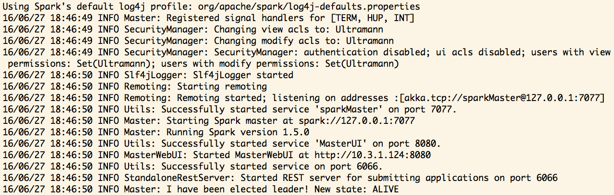
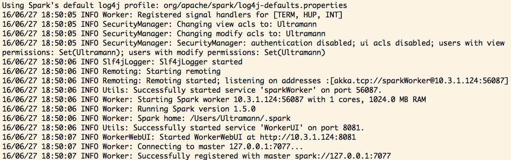
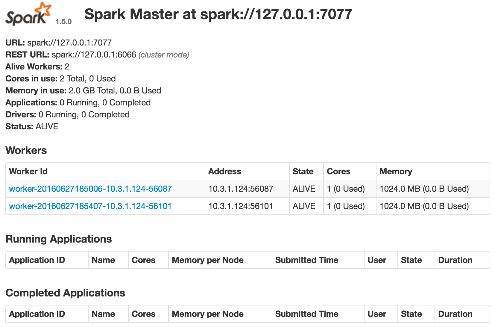
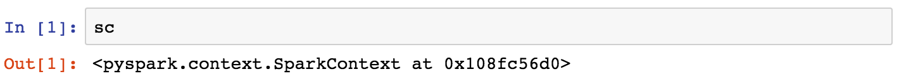
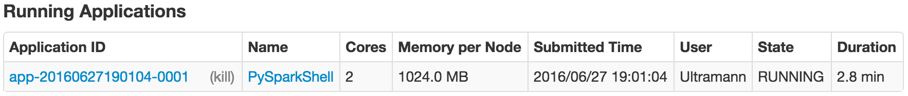
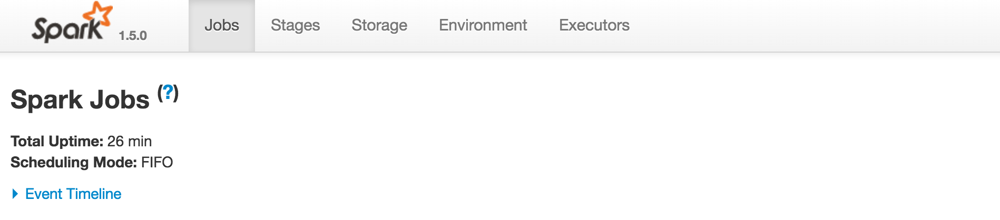
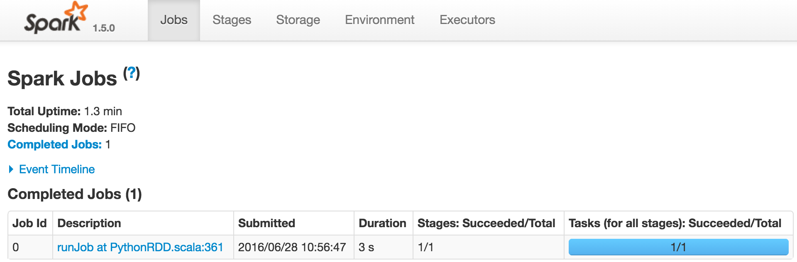
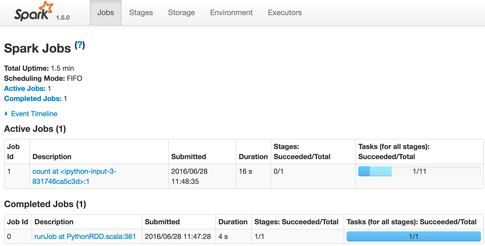
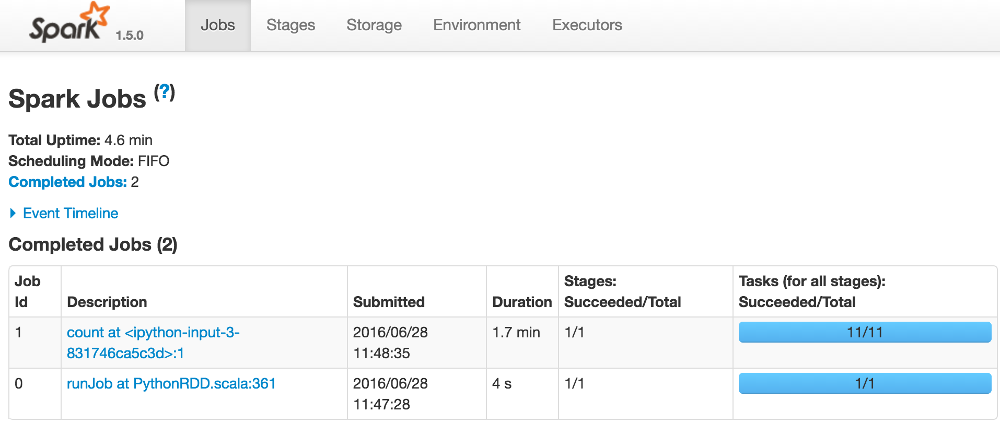
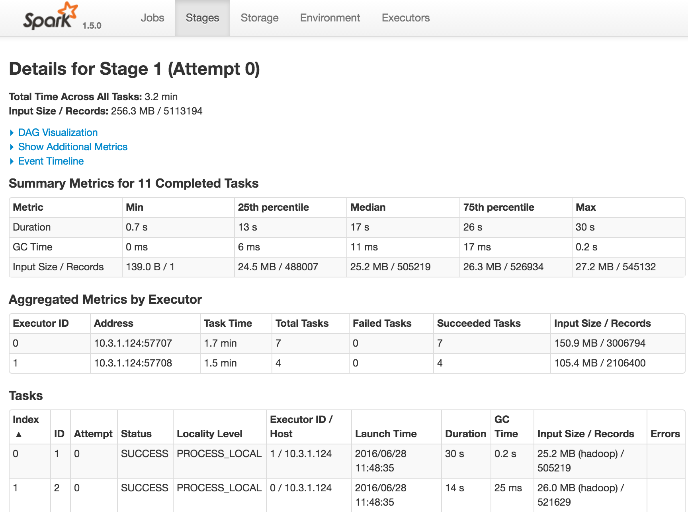

## Part 1: RDD and Spark Basics

Here we will get familiar with the basics of Spark via the Spark Python API, 
`PySpark`. For now, we will be just working with a single node that will 
parallelize processes across all of our cores (rather than distributing them 
across worker nodes). In `Part 3`, we are going to simulate a master-worker
cluster to run our jobs.

1. Initiate a `SparkContext`. A `SparkContext` specifies where your cluster is,
   i.e. the resources for all your distributed computation. Specify your
   `SparkContext` as follows.

   ```python
   import pyspark as ps
   # Uses all 4 cores on your machine
   sc = ps.SparkContext('local[4]')
   ```

   **Note**: You may not have 4 cores on your machine, and if you don't you should
   adjust how many cores you are telling the SparkContext to use. To find out
   how many you have, you can run:

   ```python
   import multiprocessing
   multiprocessing.cpu_count()
   ```

   You should see a large log output, if there are no `ERROR` messages then you're
   to go. The `INFO` logs that you see will continue to appear everytime you have
   your spark context perform an action. If you want to suppress them and only have
   potential `ERROR`s get displayed you can run `sc.setLogLevel('ERROR')`.

2. Spark operates in **[Resilient Distributed Datasets (RDDs)][RDDs]. An RDD is
   a collection of data partitioned across machines**. RDDs allow the processing 
   of data to be parallelized due to the partitions. RDDs can be created from 
   a SparkContext in two ways: loading an external dataset, or by parallelizing 
   an existing collection of objects in your currently running program (in our 
   Python programs, this is often times a list).

   * Create an RDD from a Python list.

       ```python
       lst_rdd = sc.parallelize([1, 2, 3])
       ```

   * Read an RDD in from a text file. **By default, the RDD will treat each line
   as an item and read it in as string.**

       ```python
       file_rdd = sc.textFile('data/cookie_data.txt')
       ```

3. Now that we have an RDD, we need to see what is inside. RDDs by default will
   load data into partitions across the machines on your cluster. This means that
   you can quickly check out the first few entries of a potentially enormous RDD
   without accessing all of the partitions and loading all of the data into memory.

   ```python
   file_rdd.first() # Returns the first entry in the RDD
   file_rdd.take(2) # Returns the first two entries in the RDD as a list
   ```

4. To retrieve all the items in your RDD, every partition in the RDD has to be
   accessed, and this could take a long time. In general, before you execute
   commands (like the following) to retrieve all the items in your RDD, you
   should be aware of how many entries you are pulling. Keep in mind that to
   execute the `collect()` method on the RDD object (like we do below), your entire
   dataset must fit in memory in your driver program (we in general don't want
   to call `collect()` on very large datasets). 
   
   The standard workflow when working with RDDs is to perform all the big data 
   operations/transformations **before** you pool/retrieve the results. If the 
   results can't be collected onto your driver program, it's common to write 
   data out to a distributed storage system, like HDFS or S3.

   With that said, we can retrieve all the items from our RDD as follows:

   ```python
   file_rdd.collect()
   lst_rdd.collect()
   ```

## Part 2: Intro to Functional Programming

Spark operations fit within the [functional programming paradigm][funct-programming].
In terms of our RDD objects, this means that our RDD objects are immutable and that 
anytime we apply a **transformation** to an RDD (such as `map()`, `reduceByKey()`,
or `filter()`) it returns another RDD.

Transformations in Spark are lazy, this means that performing a transformation does 
not cause computations to be performed. Instead, an RDD remembers the chain of 
transformations that you define and computes them all only when and action requires 
a result to be returned.

**Spark notes**:

   * A lot of Spark's functionalities assume the items in an RDD to be tuples
   of `(key, value)` pairs, so often times it can be useful to structure your
   RDDs this way.
   * Beware of [lazy evaluation][wiki-lazy-eval], where transformations
   on the RDD are not executed until an **action** is executed on the RDD
   to retrieve items from it (such as `collect()`, `first()`, `take()`, or
   `count()`). So if you are doing a lot transformations in a row, it can
   be helpful to call `first()` in between to ensure your transformations are
   running properly.
   * If you are not sure what RDD transformations/actions there are, you can
   check out the [docs][RDD-docs].

**Steps**:

1. Turn the items in `file_rdd` into `(key, value)` pairs using `.map()`. Map 
each item into a json object (use `json.loads()`) and then map the json object 
to a `(key, value)` pair. You can do this with two maps each with its own lambda,
or with a single map and a function. **Remember to cast value as type** `int`.  Use
`collect()` to see your results. Using `collect()` is fine here since the data is
small. Make sure that:

   * **The key is the name of the person**.
   * **The value is how many chocolate chip cookies they bought**.


2. Now use `filter()` to look for entries with more than `5` chocolate chip cookies.

3. For each name, return the entry with the max number of cookies.

   **Hint**: 
    * Use `reduceByKey()` instead of `groupByKey()`. See why [here][groupby-v-reduceby-key].
    * You may get a warning saying that you should install `psutil`. You can with 
    `pip install psutil`.


4. Calculate the total revenue from people buying cookies (we're assuming that
each cookie only costs $1).

   **Hint**:
   * `rdd.values()` returns another RDD of all the values.
   * Use `reduce()` to return the sum of all the values.

## Part 3: Starting a Local Cluster

Here we will simulate starting a master/worker cluster locally. This is different
from parts 1 and 2 in that there will now be "workers", on separate cores of your
computer, that the "master", also living on it's own core, will communicate with. 

Simulating a master/worker cluster is useful since it allows us to develop code 
and test how it performs on a small cluster before deployment to multiple machines.
This way, we can work out any of the kinks/problems that might be in our programs,
that manifest on actual clusters, before using valuable computation resources.

We will be using [tmux](http://tmux.github.io/) to run our scripts in
the background. tmux lets us *multiplex* our terminal, create terminal sessions,
and attach/detach from those sessions in the terminal (somewhat like running
processes in hidden terminals). This will be useful because it allows us to put our 
cluster processes on terminal sessions that are running in the background.

Here is a **quick** guide to tmux for you to skim through:

```bash
brew install tmux             # Install tmux with homebrew
tmux new -s [session_name]    # Start a new tmux session
ctrl + b, d                   # Detach from that tmux session
tmux ls                       # Get a list of your currently running tmux sessions
tmux attach -t [session_name] # Attach to an existing session
```
Check out [this](https://gist.github.com/MohamedAlaa/2961058) tmux cheatsheet for
a reference on a bunch of things tmux can do.

<br>

Now let's use tmux to create a local cluster, master and workers, which run in 
background terminal sessions.

1. Start a tmux session which will host your master node:

   ```bash
   tmux new -s master
   ```
2. Run the following command to set up the Spark master to listen on local IP.
The Master class in `org.apache.spark.deploy.master` accepts the following
parameters:

   * `h`: host, local host, `127.0.0.1`, in our case.
   * `p`: The port on which the master is listening on, `7077`.
   * `webui-port`: The port on which the web user interface (UI) is reachable,`8080`.

   <br>

   ```bash
   ${SPARK_HOME}/bin/spark-class org.apache.spark.deploy.master.Master \
   -h 127.0.0.1 \
   -p 7077 \
   --webui-port 8080
   ```

   The `${SPARK_HOME}` refers to the environment variable that you set up in your
   bash profile when you followed the Spark installation instructions.

3. You should get some output in your terminal similar to the following:
   <br>
   <div style="text-align: center"></div>
   <br>

4. Detach from your master session(`crtl+b d`). Start a new tmux session which
   will host your first worker node:

   ```bash
   tmux new -s worker1
   ```

5. Run the command below to set up a Spark worker connected to the master.
The Worker class in `org.apache.spark.deploy.worker` accepts the following
parameters:

   * `c`: the number of cores Spark applications are allowed to use on the worker machine.
   * `m`: amount of memory Spark applications are allowed to use on the worker machine.
   * the URL the master is listening on, IP and port. We specified this when we created the
   master above.

   <br>

   ```bash
   ${SPARK_HOME}/bin/spark-class org.apache.spark.deploy.worker.Worker \
   -c 1 \
   -m 1G \
   spark://127.0.0.1:7077
   ```

   This will start a worker with access to 1 core and 1 GB of memory and attach it to the
   previously created Spark master. The output in your terminal should look like:

   <div style="text-align: center"></div>
   <br>

6. Detach from the current session, create a new session (name it worker2 this time), 
and run the same command as in `5` to create a second worker. You should detach from this
tmux session as well.

7. You have now set up a local Spark cluster with a master and 2 workers. Spark 
also provides a web UI that lets us track our Spark jobs and see other stats 
about any Spark related tasks and workers. It is available at the port we specified
when we created the master.

   <h3 style="color:red">Your web UI is at: <code>localhost:8080</code></h3>

   <div style="text-align: center"></div>
   <br>

8. We are not yet running any applications on our local Spark cluster. To interact
with our cluster we can attach an IPython notebook to the master and start
`pyspark` by running the command below. 

   ```bash
   IPYTHON_OPTS="notebook"  ${SPARK_HOME}/bin/pyspark \
   --master spark://127.0.0.1:7077 \
   --executor-memory 1G \
   --driver-memory 1G
   ```

This will start the notebook in the browser and assign 1G of RAM per executor,
worker node, and 1 GB of memory to the master in our pyspark application. Then,
we can interact with `pyspark` via a SparkContext, just like we did in parts 1
and 2. The difference here is that we actually have worker nodes that our master 
will communicate with and assign tasks to.

9. A SparkContext available in the IPython notebook. Access it via the variable `sc`.

   You will see an output like below:

   <div style="text-align: center"></div>
   <br>

10. Now if you refresh your Spark web UI, you should see **`PySparkShell`** running 
in the list of applications.

   <div style="text-align: center"></div>
   <br>

## Part 4: Spark for Data Processing

Using the cluster we set up in `Part 3` we will explore airline data. The data are stored
on S3 so you will need your AWS access key and secret access key.

### Side Note About Personal Credentials

It's good practice to keep personal credentials stored in environment variables set in 
your bash profile so that you don't have to hard code their values into your solutions.
This is particularly important when the code that uses your keys is stored on GitHub 
since you don't want to be sharing your access keys with the world. To do this make
add the lines below to your bash profile.

Before you do so, check your AWS keys to make sure they don't have a slash in them. If
you see a slash in one you can get a new one on AWS. All you have to do is go to "Security Credentials" under your account in the AWS dashboard, then look under the "Access Keys"
option. Click `Create New Access Key` and make sure that it doesn't have a slash in it either.
Do this until you get slash-free keys. Use those as your environment variables as shown below.

```bash
export AWS_ACCESS_KEY_ID=YOUR ACCESS KEY
export AWS_SECRET_ACCESS_KEY=YOUR SECRET ACCESS KEY
```

Keep in mind that if you ever have to change your keys you'll need to make sure that you
update your bash profile.

Now you're ready to load up and explore the data all while becoming more familiar with
Spark.

### Loading Data and Interacting With the Spark UI

1. Go to the web UI for your cluster in your browser, located at `localhost:8080`. 
**Note**: If you have issues with proxy settings and you're using Firefox, try using 
Chrome.

   Click on `PySparkShell` in the "Name" column under "Running Applications". You should
see an empty page like the following.

   <div style="text-align: center"></div>

2. Load the data from S3 as follows. **Note**: As discussed above, loading won't work if 
either of your AWS keys contain a slash. Generate a new pair if necessary by following
the steps outlined above.

   ```python
   import os
   access_key = os.getenv('AWS_ACCESS_KEY_ID')
   secret_key = os.getenv('AWS_SECRET_ACCESS_KEY')

   link = 's3n://{}:{}@mortar-example-data/airline-data'.format(access_key, secret_key)
   airline_rdd = sc.textFile(link)
   ```

3. Print the first 2 entries with `take(2)` on `airline_rdd`. The first entry is the
column names and starting with the second we have our data. If you reload the previously
empty jobs page you'll see information about the action, `take(2)` that you just had Spark
perform.

   <div style="text-align: center"></div>

4. Now run `count()` on the RDD. This will **take a while**, as the data set is a few 
million rows and it all must be downloaded from S3. If you look at the jobs page, reloading
every so often, while it's happening you'll see that it's tells you about how much of the
job has been completed along with information about the prior jobs.

   <div style="text-align: center"></div>

   Once the job has been complete the jobs page will look like this:

   <div style="text-align: center"></div>

5. You can inspect the details of a specific job by clicking on it's link in the
"Description" column of the jobs page. You'll see the same information as on the
jobs page, a quick summary of the tasks; but, if you click on the link in the
"Description" column for the stage (there was only one stage for this job), you will
see page detailing everything about that stage.

   <div style="text-align: center"></div>

### Data Time

Now that you've got a feel for looking at the Spark web UI, it may be useful to look at it
throughout the rest of the sprint, we can move on to looking at and transforming the data.
We want to identify airports with the worst / least delays. Consider the following about delays:

* **2 types of delays:** Arrival delays, `ARR_DELAY`, and departure delays, `DEP_DELAY`.
* All delays are in terms of **minutes**.
* Arrival delays are associated with the destination airport, `DEST_AIRPORT_ID`.
* Departure delays are associated with the origin airport, `ORIGIN_AIRPORT_ID`.


1. As you just saw the `count()` action takes a long time to run. More involved
commands can take even longer. In order to not waste time when writing/testing
your code, it's common practice to work with a sub-sample of your data until
you have your code finalized/polished and ready to run on the full dataset. Use
`take(100)` to sample out the first 100 rows and assign it to a new RDD using
`sc.parallelize()`.

2. Let's do some preprocessing. Write a function to map over an RDD to remove the
all single quotes, `'`,  double quotes, `"`, and the trailing `,` for each line.
Print the first 2 lines, with `take(2)`, to confirm you've cleaned the rows correctly.
The first 2 lines should look like the following.

   ```
   YEAR,MONTH,UNIQUE_CARRIER,ORIGIN_AIRPORT_ID,DEST_AIRPORT_ID,DEP_DELAY,DEP_DELAY_NEW,ARR_DELAY,ARR_DELAY_NEW,CANCELLED
   2012,4,AA,12478,12892,-4.00,0.00,-21.00,0.00,0.00
   ```

3. Use `filter()` with a `lambda` function to filter out the line containing the
column names. Split that line on ',' to get a **list** of column names (you'll
need these column names in the next step).

4. Write a function, `make_row_dict()`, that takes a row as an argument and
returns a dictionary where the keys are column names and the values are the values
for the column. Follow the specifications below to make your dictionary.

   * The dictionary will only keep track of the following columns:

    `['DEST_AIRPORT_ID', 'ORIGIN_AIRPORT_ID', 'DEP_DELAY', 'ARR_DELAY']`
   * Cast the values for `DEP_DELAY` and `ARR_DELAY` as floats. These values
   correspond with delay lengths in minutes.
   * Subtract `DEP_DELAY` from `ARR_DELAY` to get the actual `ARR_DELAY`.
   * If a flight is `CANCELLED`, add 5 hours, 300 minutes, to `DEP_DELAY`.
   * There are missing values in `DEP_DELAY` and `ARR_DELAY` (i.e. `''`) and
     you would want to replace those with `0.0`.

   Map `make_row_dict()` over your RDD to make a new dictionary RDD.

5. Instead of dictionaries, make 2 new RDDs where the items are tuples. Remember, much
of Spark's functionality assumes RDDs to be storing (key, value) tuples.

   The first RDD will contain tuples `(DEST_AIRPORT_ID, ARR_DELAY)`. The other RDD will contain
   `(ORIGIN_AIRPORT_ID, DEP_DELAY)`. Run a `first()` or `take()` to confirm your results.

6. Using the two RDDs you just created, make 2 RDDs with the mean delay time for
origin airports and destination airports. You will need to `groupByKey()` and then
take the mean of the delay times for each airport. Use `mapValues()` to calculate
the mean of each group's values.

   This is where having our RDDs be composed of `(key, value)` pairs is very useful.
   It allows us to use the `groupByKey()` method on our RDD.

   Note: There is a slightly more performant way of calculating the mean which uses
   `aggregateByKey()` rather than `groupByKey()`. This transformation models the combinor
   model that we saw in Hadoop. Unfortunately, the documentation for `aggregateByKey()` is
   quite poor. Check out [this](http://stackoverflow.com/a/29930162) stack overflow post
   for a good description for how to use it.

7. Run `cache()` on the RDDs you made. Remember to set the name of the RDD using
`.setName()` before running `cache()` (e.g. `rdd.setName('airline_rdd').cache()`). Setting
the name will allow you to identify the RDD in the Spark web UI.

   When you cache the RDDs, you make sure that computations which produced them don't
   need to be performed every time they are called upon. It is good practice to use `cache()`
   for RDDs that you are going to repeatedly use.

8. Use `rdd.sortBy()` to sort the RDDs by the mean delay time to answer the
following questions:

    * What are the top 10 departing airports that have the lowest average delay.
    * What are the top 10 departing airports that have the highest average delay.
    * What are the top 10 arriving airports that have the lowest average delay.
    * What are the top 10 arriving airports that have the highest average delay.

    You'll need to run all the transformations that you tested on the smaller dataset 
    on the full data set to answer these questions.


[RDDs]: http://spark.apache.org/docs/latest/programming-guide.html#resilient-distributed-datasets-rdds
[funct-programming]: https://en.wikipedia.org/wiki/Functional_programming
[wiki-lazy-eval]: http://en.wikipedia.org/wiki/Lazy_evaluation
[RDD-docs]: http://spark.apache.org/docs/0.7.3/api/pyspark/pyspark.rdd.RDD-class.html
[groupby-v-reduceby-key]: https://github.com/databricks/spark-knowledgebase/blob/master/best_practices/prefer_reducebykey_over_groupbykey.md

